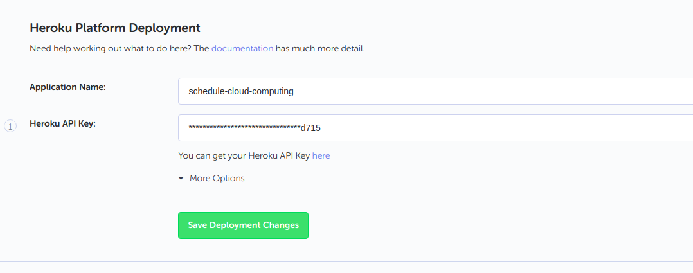
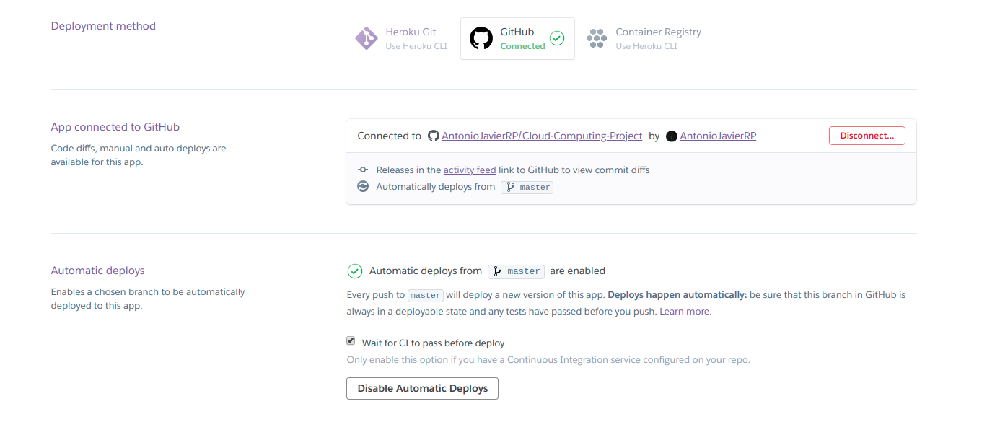

Despliegue https://planificacion-deportiva.herokuapp.com/

# Hito 2. Creación de un microservicio y despliegue en PaaS

En esta tercera entrega de la asignatura se ha creado una estructura muy simple de la función básica de nuestro proyecto de forma que se pudiese acceder a la información a través de comandos HTTP(get, put, post y delete).

Una vez que se ha comprobado que la estructura funcionaba bien de forma local, esta se ha desplegado en Heroku.

He elegido Heroku como PaaS para mi servicio web debido a que es gratuito(para nuestro caso), tiene una amplia documentación y tutoriales para iniciarse en su uso y además es compatible con nodejs.

## Framework usado
Como ya dije antes, he usado javascript en node JS, por lo que el framework que he usado ha sido express.

## Funcionalidad Básica creada

He creado tres clases:
- Plan: Es la clase principal que integra al resto. En esta figura como artibuto el usuario (tipo PerfilUsuario), la fecha de inicio del plan, la duración del plan, y un vector completo de todas las actividades (sesiones de entrenamiento) que se piensan hacer.
- PerfilUsuario: en esta figura el nombre del usuario y dos atributos inicializados a un valor por defecto pero que es modificable y que influenciará a la hora de decidir si se puede realizar una actividad cierto día. 
- Activity: cada objeto de esta clase es una sesión de entrenamiento diferente. Cada sesión de entrenamiento tiene asignado:
    -   Un id.
    -   Un día (pero no en formato fecha sino en enteros hasta el día último de entrenamiento en base a la duración del plan)
    -   Un tipo (que por ahora sólo puede ser: correr, pasear, salir en bici, entrenamiento de fuerza, nadar y deporte de equipo)
    -   Una descripción (opcional)
    -   Una duración en horas del ejercicio.
    -   Una hora de inicio del ejercicio.
    -   Y un booleano que indica si se va a realizar o no en el exterior.

### Cada una de las acciones que se puede hacer sobre esta estructura se puede llevar  a cabo mediante operaciones HTTP:

#### Consultas con GET

- Status Ok en "/"
- Plan completo en "/plan"
- Detalles del usuario en "/plan/usuario"
- Nombre del usuario en "/plan/usuario/nombre"
- Temperatura mínima a la que el usuario está dispuesto a hacer ejercicio en "/plan/usuario/temp"
- Tolerancia a la lluvia del usuario en "/plan/usuario/rain"
- Lista de todas las actividades en '/plan/actividades'
- Lista de todas las actividades por día en '/plan/actividades/:dia'
- Actividad concreta en cierto día en '/plan/actividades/:dia/:id'

#### Modificaciones con POST

- Valores del usuario en "/plan/usuario"
- Valores de cierta actividad en "/plan/actividades/:dia/:id"

#### Nuevos elementos con PUT

- Nueva actividad en "/plan/actividades"

#### Eliminar elementos con DELETE

- Eliminar actividad concreta en '/plan/actividades/:dia/:id'

He ido comprobando el correcto funcionamiento de cada una de estas operaciones mediante [Postman](https://www.getpostman.com/).

## Tests

Para realizar los tests, de cada una de las operaciones que acabo de mencionar, he creado un fichero test.js dentro de la carpeta test del proyecto.
Para especificar los tests he usado Supertest y Mocha.

Así mismo, he usado Travis CI para que se ejecuten los tests que he creado cada vez que se haga un push al repositorio master.

Para ello he iniciado sesión en [Travis](https://travis-ci.org/) con mi cuenta de Github para que quede así vinculada y he seleccionado [este](https://github.com/AntonioJavierRP/Cloud-Computing-Project) repositorio para que realize los test que le he especificado en el archivo [.travis.yml](https://github.com/AntonioJavierRP/Cloud-Computing-Project/blob/master/.travis.yml)
para que, cada vez que el respositorio se modifique, compruebe que funciona todo correctamente.

## Despliegue en Heroku

Para realizar el despliegue en Heroku en primer lugar he seguido las instrucciones básicas de la [página de documentación de heroku sobre node js](https://devcenter.heroku.com/articles/getting-started-with-nodejs).

Los pasos seguidos para el despliegue según este tutorial son:
1. Instalar Heroku CLI.
2. Hacer  heroku create desde la terminal dentro de nuestra carpeta local del reposotorio.
3. Hacer git push heroku master.

Tendremos en nuestra carpeta ahora una archivo llamado "Procfile", en este archivo se indica a Heroku los comandos que tiene que ejecutar mi app de Heroku al iniciarse en formato <process type>: <command>, en nuestro caso es:

~~~~
web: node index.js
~~~~

"web" porque se trata de una aplicación web.

"node index.js" es el comando que tiene que ejecutar cada dyno.

Y con esto ya estaría despleguado en Heroku en el enlace con nombre aleatorio que se creó cuando hicimos el segundo paso.

Pero así no es como queremos que se realice el despliegue. Queremos poder estar trabajando localmente en nuestro ordenador y que cuando hagamos algún cambio al proyecto y le hagamos push a Github, se realice un despliegue automático a Heroku desde Github una vez se hayan pasado los tests.

Para hacer esto en primer lugar hice uso de [Codeship](https://codeship.com/):

Tuve que vincular mi cuenta de github con Codeship, crear un nuevo proyecto en Codeship en el que especifiqué el repositorio de mi proyecto de CC en Github y por último configuré el deployment en Heroku desde Codeship de ese repositorio cada vez que se le haga push, dandole el nombre de nuestra app creada en heroku y nuestra api key como podemos ver en la captura a continuación:

La página del despliegue en codeship es la siguiente: https://schedule-cloud-computing.herokuapp.com/

Codeship se encarga tambíen de hacer los tests, configurándolo en la pestaña de Test en "comandos necesarios para el despliegue" y en "test pipeline", especificado que ejecute "npm test" para que así se pasen los test que especifiqué en el archivo test.js.

Pero de esta forma no tenemos el script que ordena que se ejecuten los tests en nuestro propio repositorio. Y nos conviene tenerlo, por lo que en lugar de usar Codeship podemos conseguir lo mismo configurando el despliegue automático en la página de Heroku, vinculando nuestra cuenta de Github.

Para ello tan solo tenemos que:
* En nuestra "Dashboard" de Heroku, seleccionamos "Create new app".
* Elegimos nombre y región.
* Nos vamos a la pestaña Deploy de nuestra app creada.
* En Deployment method seleccionamos Github.
* Iniciamos sesión con nuestra cuenta de Github.
* Seleccionamos el repositorio en el que se encuentra nuestro proyecto.
* Y por último seleccionamos enable automatic deploys.

No olvidar tambien seleccionar la acción "Wait for CI to pass before deploy", ya que esto hará que no se despliegue a Heroku hasta que se pasen los tests Travis CI.

