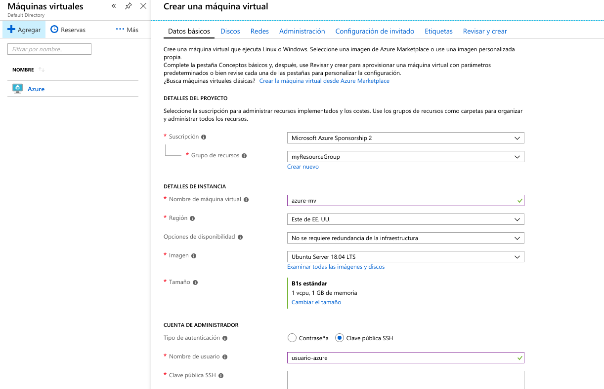
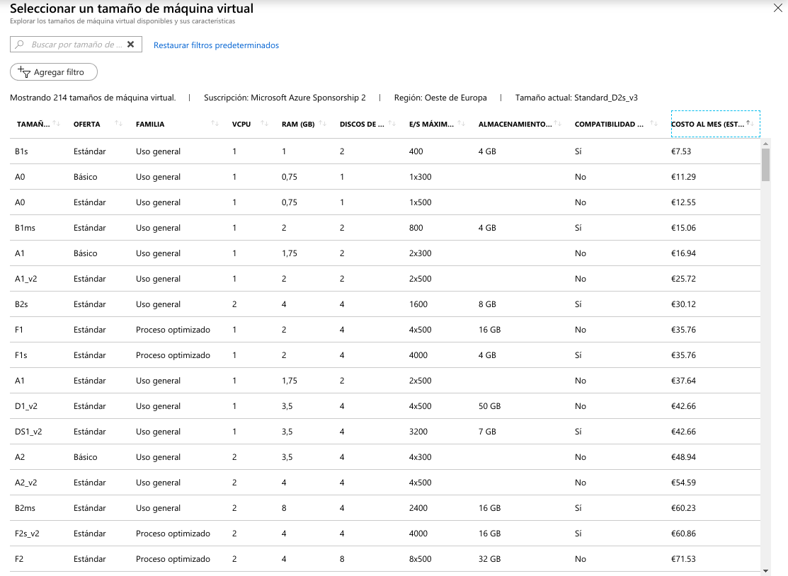
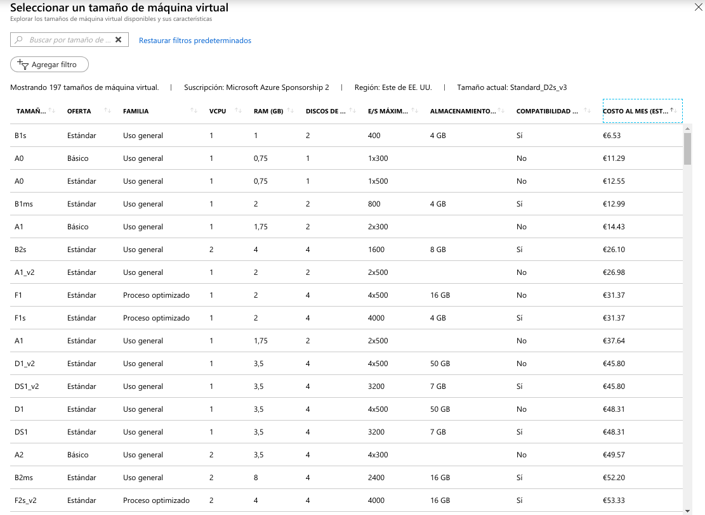
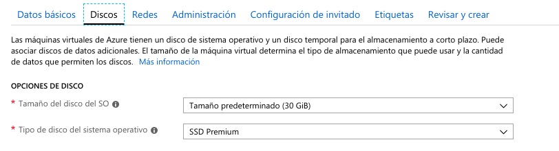
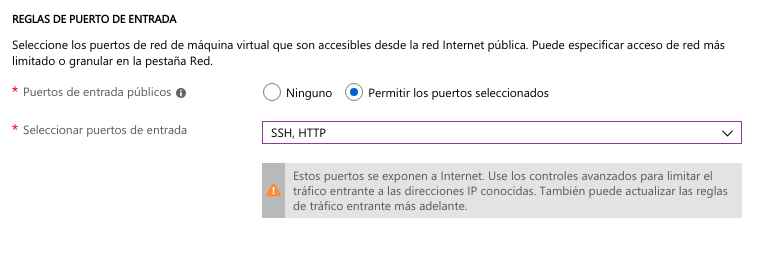
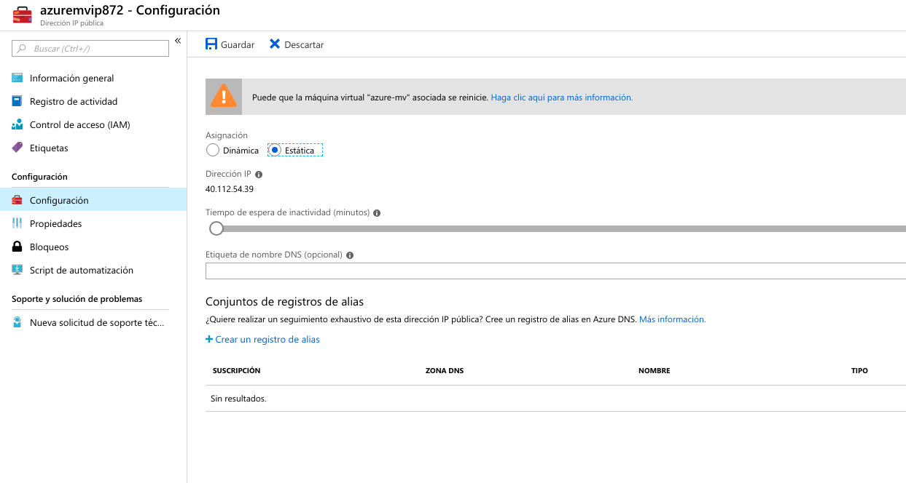
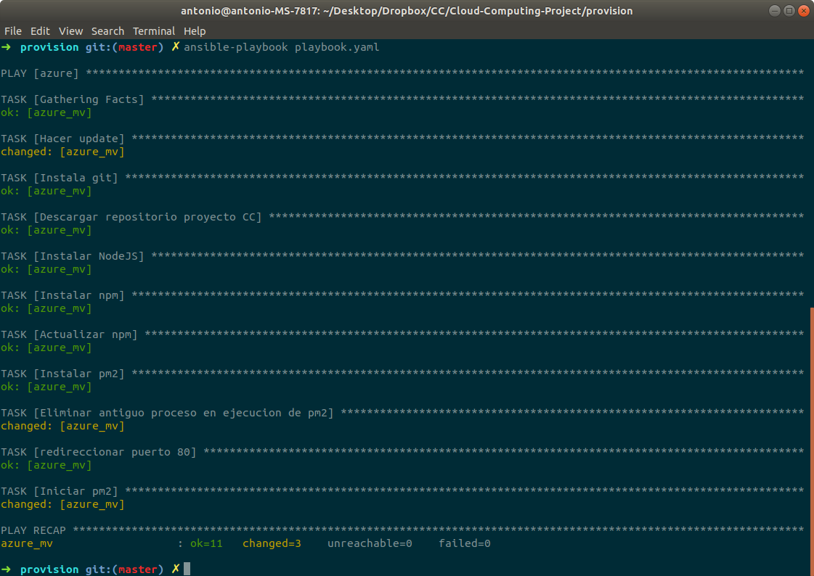
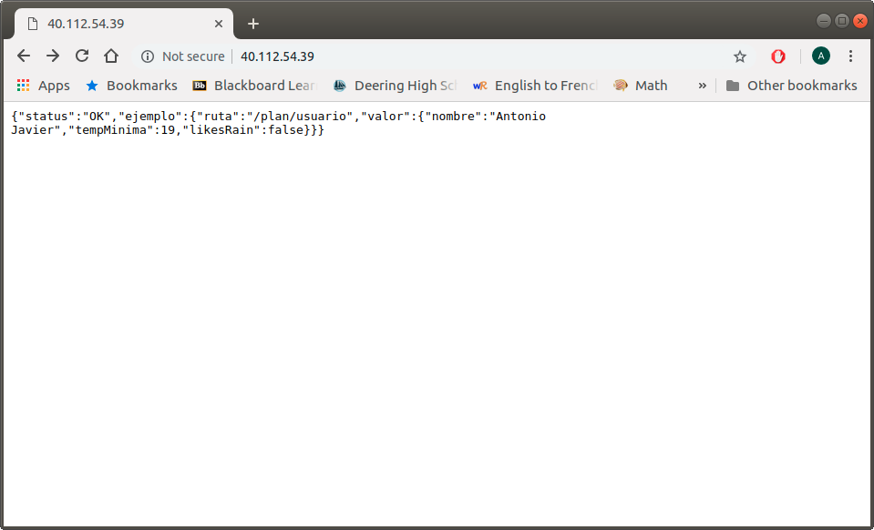

# Hito 3. Provisionamiento de máquinas virtuales

MV: 40.112.54.39

En este hito se ha desplegado nuestro proyecto de planificación deportiva en una máquina virtual en la nube creada a través de Azure, se ha automatizado el provisionamiento con Ansible y se le ha añadido una nueva funcionalidad a la aplicación.

## 1. Sistema remoto usado.

Se ha usado Azure como servicio en la nube de creación de maquinas virtuales.
La razón por la cual se ha elegido es porque contamos con dinero en este servicio que el profesor nos ha aportado.

### 1.1 Creación de la MV.

Para crear la máquina virtual podemos ir a la pestaña de "Todos los servicios" en el portal principal de Azure una vez hayamos iniciado sesión en nuestra cuenta.

Seleccionamos maquinas virtuales y crear una nueva (agregar).
Una vez llegados a este punto, tendremos que rellenar los datos básicos sobre la infraestructura que queremos que tenga nuestra máquina virtual tal y como podemos observar en la siguiente captura:

En la columna izquierda se listan las máquinas virtuales ya existentes. En mi caso ya tengo una llamada "Azure" con la cual he realizado las pruebas necesarias para realizar el provisionamiento.
La máquina virtual que estamos creando en las capturas de pantalla es en la que hemos desplegado definitivamente nuestro proyecto.

## 2. Infraestructura usada. 

Como se puede apreciar en la captura anterior la máquina virtual se llamará "azure-mv" y su región será "Este de Estados Unidos", debido a que es la región que ofrece el menor precio en las opciones de tamaño (CPU y memoria).

### 2.1 Sistema operativo. 
Como sistema operativo, para nuestra máquina virtual, se ha escogido Ubuntu Server 18.04 LTS. 

En primer lugar una de las razones por las que he escogido Ubuntu Server es porque tengo experiencia previa con este sistema.

Por otra parte se ha escogido la distribución Server en lugar de la Desktop debido a que no necesitaremos un GUI para la ejecución de nuestra aplicación ni los paquetes extra que trae la distribución Desktop de Ubuntu.

Ademas de esto, de entre las distribuciones Linux más usadas, Debian y Ubuntu cuentan con mas paquetes básicos que por ejemplo CentOS.
Ubuntu además es el más popular y por tanto cuenta con mejor soporte online y soporte de proveedores de servidores virtuales.

Por último, al tratarse de una Long Termn Support (LTS) Version es más estable y tiene 5 años de soporte (frente a los 3 años de soporte de Debian).
He escogido la versión 18 ya que es la más reciente.

### 2.2 Memoria y CPU.

Por otra parte, en lo referido a la CPU y memoria, Azure dispone de un amplio abanico de opciones llamadas "series" con diferentes precios que varían en función a la región que se haya especificado y de los recursos de memoria y GPU que ofrecen.

 Por ejemplo en las dos capturas siguientes muestro los precios ordenados de más barato a más caro de los tamaños disponibles para el oeste de Europa y el este de Estados Unidos respectivamente:

Como se puede apreciar y como ya mencioné anteriormente, la región "Este de EE.UU" es la que ofrece los precios más bajos y por esta razón se ha escogido. El tamaño B1s es el más barato y cuenta con 1 CPU y 1 GB de ram aunque también nos habría bastado con el tamaño A0 Básico, pero al costar más y ofrecer menos, nos terminamos decantando por el B1s Estándar.

### 2.3 Almacenamiento.

Por ultimo en lo referente a almacenamiento requerido usaremos lo mínimo ofrecido: 30GB. El disco será SSD premium, ya que ofrece mejores velocidades y no requiere un pago superior que el HDD, aunque podríamos perfectamente usar el HDD para nuestra aplicación.

### 2.4 Configuración del resto de opciones y puertos.

A continuación, para continuar con la creación de la máquina virtual, especificamos el nombre de usuario de la máquina virtual, que en nuestro caso será "usuario-azure" y nos autentificaremos usando nuestra clave pública SSH (que es la que tenemos en ~/.ssh/id_rsa.pub).

Para terminar, en el apartado de "REGLAS DE PUERTO DE ENTRADA" elegiremos "Permitir los puertos seleccionados" y seleccionaremos los puertos de entrada SHH y HTTP para que se pueda acceder a la ip por SSH y con el navegador por el puerto 80:

Una vez creada la maquina virtual, es importante que cambiemos en la configuración de la IP de nuestra máquina virtual, que se haga una asignación estática de forma que no se genere una nueva IP cada vez que reiniciamos la MV:

## 3. Provisionamiento.

Para gestionar de forma remota la máquina virtual creada he usado Ansible. Ansible es una herramienta open source que hace posible configurar el aprovisionamiento y despliegue automático de aplicaciones de forma sencilla.
Para ello hemos usado un archivo "receta" llamado playbook en el que se especifica la configuración que queremos que tenga nuestro sistema.

Hemos nombrado al archivo [playbook.yaml](enlacerepositorio) y se encuentra en el directorio "provision" de nuestro repositorio. En el siguiente apartado lo describiré en mayor profundidad.

Además del playbook, hemos incluido otros dos archivos en los que especificamos nuestra configuración de Ansible:
- ansible.cfg: 
    
    Ansible trae su propio fichero de configuración básica, pero con este especificamos detalles extra de configuración.
    
    Tan solo contiene lo siguiente:

~~~~
[defaults]
host_key_checking = False
inventory = ./ansible_hosts
~~~~

La primera opción evita que ssh haga la comprobación de Host key para evitarnos problemas con el cambio de MAC a la hora de establecer conexión.

La segunda especifica donde va a estar el fichero de hosts.

- ansible_hosts:
    
    En este fichero especificamos la máquina a la que vamos a acceder, detallando el puerto por el que vamos a acceder, dónde se encuentra nuestra clave ssh para el acceso y la IP de nuestra máquina:
~~~~
[azure]
azure_mv ansible_ssh_port=22 ansible_ssh_private_key_file=~/.ssh/id_rsa.pub ansible_ssh_host=40.112.54.39

[azure:vars]
ansible_ssh_user=usuario-azure
~~~~

### 3.1 Playbook.yaml.

En este archivo especificamos en formato YAML lo que se tiene que instalar y ejecutar para desplegar nuestra aplicación en la máquina virtual.

A continuación describo la estructura de mi propio playbook:

* En primer lugar especificamos en hosts las maquinas virtuales (de las definidas en ansible_hosts) que ejecutarán las acciones especificadas.

* Con become: yes, especificamos que se ejecute todo como super usuario.

* Definimos una variable llamada ruta_proyecto. que es una ruta donde más tarde situaremos nuestro repositorio del proyecto de github y a la que recurriremos repetidas veces a la hora de definir las tareas.

* A continuación especificamos las tareas que se tienen que realizar con "tasks" (el estado que tiene que alcanzar la maquina virtual).

* La primera acción consiste en hacer un update para asegurarnos de que se instala la ultima version de los paquetes que más tarde especificamos.

* Con la segunda acción instalamos git si no esta ya instalado.

* La tercera acción descarga el repositorio de nuestro proyecto de Github en la ruta que habíamos especificado como variable.

* Instalamos o nos aseguramos de que estén instalados node y npm con la cuartas y quinta acciones.

* Actualizamos npm en la ruta definida, para que se instalen todos los paquetes que requiere nuestro proyecto.

* Instalamos pm2 para poder ejecutar nuestro proyecto y que se quede en segundo plano para que Ansible no se quede en constante ejecución (que es lo que pasaría si lo ejecutásemos directamente con "node index.js").

* Usamos pm2 para poder eliminar el antiguo proceso ya lanzado, lo cual nos devolverá error en la primera ejecución (ya que no existirá ninguno), por esta razón usamos "ignore_errors:yes".

* Redireccionamos el puerto 3000 al 80.

* Y terminamos lanzando el proceso con pm2.

Para que ansible haga uso de este playbook en nuestra máquina virtual tan sólo tendremos que ejecutar la siguiente orden:

~~~~
ansible-playbook playbook.yaml
~~~~

Esto nos da la siguiente salida:

Todo se ha ejecutado correctamente.

Podemos comprobar que se ha desplegado correctamente, accediendo a la IP de nuestra MV desde nuestro navegador:

## 4. Funcionalidad Añadida.

Se le ha añadido a nuestra aplicación de planificación deportiva un sistema de log más sofisticado haciendo uso de los paquetes de npm: Winston y Morgan.

Gracias a estos, ahora es posible visualizar todas las peticiones get, put, post y delete que se le hagan a nuestra aplicación, con el código de error devuelto, a través de la consola. Además, también se creará automáticamente una carpeta llamada "log" en la que se guardarán ficheros de logs, con todas las alertas, errores, warnings, etc que devuelva nuestra aplicación durante el día, generándose un nuevo fichero al día siguiente.

Para conseguir esto he añadido un fichero logger.js donde usamos el paquete de npm "Winston" para especificar un formato de log concreto, unos niveles de de los cuales dependerá que mensajes podremos visualizar y la ruta del fichero de logs que se irá generando.(en un directorio log que creará en caso de que no exista).

Además de esto, se ha modificado el archivo index.js en el que usamos Morgan para redireccionar la salida estándar y la salida de error al objeto logger con las características definidas en logger.js

## 5. Comprobación de provisionamiento.

## Comprobación provisionamiento de [Jesús Mesa González](https://github.com/mesagon):

Para realizar el provisionamiento de mi compañero he creado una nueva maquina virtual con las siguientes especificaciones en azure:

captura

A continuación he descargado su carpeta de provisión y he ejecutado su playbook de ansible con ansible-playbook playbook.yaml.Obteniendo la siguiente salida:

captura

Provisionamiento propio comprobado por Jesús Mesa González en -> [Enlace](https://github.com/mesagon/Proyecto-CC-MII0).