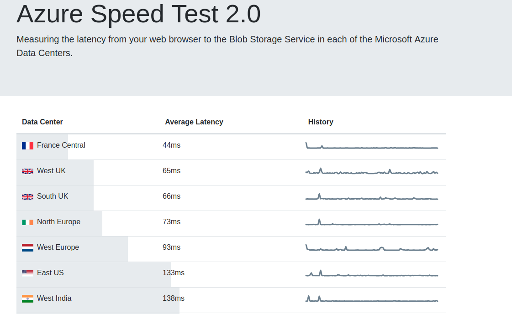
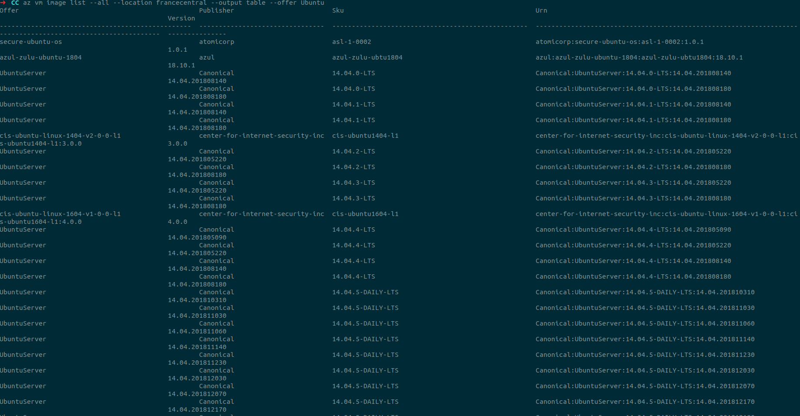

# Hito 4. Automatización de la creación de Máquinas Virtuales desde línea de órdenes.

MV2: mv.servicioclo.ud

En este hito nos hemos centrado en la creación de máquinas virtuales desde la línea de órdenes para poder realizar su provisionamiento de forma más rápida y en serie...

Uso Azure Cli 2.0 porque ya hemos estado trabajando con Azure en hitos anteriores y contamos con créditos en esta plataforma. Ademas de que es una de las mas utilizadas y cuenta con un amplio abanico de opciones de región, imágenes preparadas y planes de tamaño de máquina.

Para crear una máquina virtual con la linea de ordenes usando Azure Cli 2.0 en primer lugar lo instalamos con apt con: 

        $ sudo apt-get install azure-cli

Una vez instalado iniciamos sesión con azure login y estaremos listos para usar Azure Cli.

Para crear una máquina virtual debemos de elegir la región en la que se alojará, la  imagen del SO que usará , un "publisher"(?) y un tamaño de máquina (memoria, cores y almacenamiento).

En primer lugar vamos a decidirnos por una región.

### Región

Tal y como explican en su [página oficial](https://azure.microsoft.com/en-us/global-infrastructure/regions/) Azure es el proveedor de servicios en la Nube que cuenta con más regiones globales, por lo que tenemos una gran cantidad de opciones de las que elegir.

Lo primero que tenemos que considerar a la hora de elegir una región en la que se desplegará la MV es de donde son la mayoría de los usuarios de nuestra aplicación, ya que de nada sirve que nosotros tengamos un acceso rápido al sistema si nuestros usuarios principales tienen una latencia que hace imposible que usen el sistema de forma eficaz. 
Estimo que la mayoría de los usuarios de la aplicación estarán en España ya que ésta se encuentra en español, por lo que consideraré que mi latencia será aproximadamente la misma que la de estos usuarios. 

Para determinar mi latencia en cada una de las regiones ofrecidas usaré la página de [Azure Speed Test 2.0](http://azurespeedtest.azurewebsites.net/) recomendad en la guía:
https://www.appliedi.net/blog/which-azure-region-is-the-best/

La página de Azure Speed Test nos devuelve los siguientes resultados:

Como se puede observar "France Central" es la que nos ofrece la mejor latencia con diferencia. Aún así, nos quedaremos también con "West UK" para las comprobaciones posteriores, ya que diferentes regiones ofrecen diferentes imágenes de Sistemas Operativos y diferentes costes, por lo que no podemos dejar que la latencia sea el único factor decisivo.

### Sistema Operativo.

Para visualizar la imágenes que tenemos disponibles localmente en azure podemos usar la siguiente orden:

~~~~
az vm image list
~~~~

Esto nos devuelve la información relativa a las imágenes disponibles en formato JSON:

~~~~json
[
  {
    "offer": "CentOS",
    "publisher": "OpenLogic",
    "sku": "7.5",
    "urn": "OpenLogic:CentOS:7.5:latest",
    "urnAlias": "CentOS",
    "version": "latest"
  },
  {
    "offer": "CoreOS",
    "publisher": "CoreOS",
    "sku": "Stable",
    "urn": "CoreOS:CoreOS:Stable:latest",
    "urnAlias": "CoreOS",
    "version": "latest"
  },
  {
    "offer": "Debian",
    "publisher": "credativ",
    "sku": "8",
    "urn": "credativ:Debian:8:latest",
    "urnAlias": "Debian",
    "version": "latest"
  },
  {
    "offer": "openSUSE-Leap",
    "publisher": "SUSE",
    "sku": "42.3",
    "urn": "SUSE:openSUSE-Leap:42.3:latest",
    "urnAlias": "openSUSE-Leap",
    "version": "latest"
  },
  {
    "offer": "RHEL",
    "publisher": "RedHat",
    "sku": "7-RAW",
    "urn": "RedHat:RHEL:7-RAW:latest",
    "urnAlias": "RHEL",
    "version": "latest"
  },
  {
    "offer": "SLES",
    "publisher": "SUSE",
    "sku": "12-SP2",
    "urn": "SUSE:SLES:12-SP2:latest",
    "urnAlias": "SLES",
    "version": "latest"
  },
  {
    "offer": "UbuntuServer",
    "publisher": "Canonical",
    "sku": "16.04-LTS",
    "urn": "Canonical:UbuntuServer:16.04-LTS:latest",
    "urnAlias": "UbuntuLTS",
    "version": "latest"
  },
  {
    "offer": "WindowsServer",
    "publisher": "MicrosoftWindowsServer",
    "sku": "2019-Datacenter",
    "urn": "MicrosoftWindowsServer:WindowsServer:2019-Datacenter:latest",
    "urnAlias": "Win2019Datacenter",
    "version": "latest"
  },
  {
    "offer": "WindowsServer",
    "publisher": "MicrosoftWindowsServer",
    "sku": "2016-Datacenter",
    "urn": "MicrosoftWindowsServer:WindowsServer:2016-Datacenter:latest",
    "urnAlias": "Win2016Datacenter",
    "version": "latest"
  },
  {
    "offer": "WindowsServer",
    "publisher": "MicrosoftWindowsServer",
    "sku": "2012-R2-Datacenter",
    "urn": "MicrosoftWindowsServer:WindowsServer:2012-R2-Datacenter:latest",
    "urnAlias": "Win2012R2Datacenter",
    "version": "latest"
  },
  {
    "offer": "WindowsServer",
    "publisher": "MicrosoftWindowsServer",
    "sku": "2012-Datacenter",
    "urn": "MicrosoftWindowsServer:WindowsServer:2012-Datacenter:latest",
    "urnAlias": "Win2012Datacenter",
    "version": "latest"
  },
  {
    "offer": "WindowsServer",
    "publisher": "MicrosoftWindowsServer",
    "sku": "2008-R2-SP1",
    "urn": "MicrosoftWindowsServer:WindowsServer:2008-R2-SP1:latest",
    "urnAlias": "Win2008R2SP1",
    "version": "latest"
  }
]

~~~~

No solo disponemos de estas imágenes, esto solo es una lista disponible offline, podemos acceder a la lista completa con la opción "--all", aunque esto ofrece una lista tan grande que nos conviene filtrarla un poco antes de realizar la búsqueda,por ejemplo, en caso de querer visualizar todas las imágenes que hay disponibles para la región de Francia Central y que contengan el nombre "Ubuntu" podemos usar la siguiente orden:

~~~~
az vm image list --all --location francecentral --output table --offer Ubuntu
~~~~

--output table lo devuelve en una formato más legible en lugar de en JSON.

Esto nos devuelve las siguientes imágenes:

Esta captura tan sólo contiene una pequeña parte del total que se nos devuelve(en el caso de la región del Oeste de Reino Unido también obtenemos una lista igual de larga ), por lo que deberíamos de haber filtrado aún más la búsqueda. De todas formas, con esto podemos ver que contamos con un amplio abanico de imágenes posibles en ambas regiones.

Las imágenes que vamos a comparar son :
* Ubuntu Server 18.04, con la siguiente URN: Canonical:UbuntuServer:18.04-LTS:18.04.201812060
* Ubuntu Server 16.04 con la siguiente URN: Canonical:UbuntuServer:16.04-LTS:latest
* Debian 8 con la siguiente URN: credativ:Debian:8:latest

Para ello primero creamos 2 grupos 1 para Francia central y otro para Oeste de Reino Unido:

~~~~
az group create -l francecentral -n FRrecGroup

az group create -l ukwest -n UKrecGroup
~~~~

A continuación crearemos las 6 máquinas virtuales, ya que comprobaremos las tres imágenes en ambas regiones.

Como todavía no hemos decidido cual es tamaño de máquina virtual óptimo para nuestra aplicación (esto lo elegiremos en el siguiente apartado) usaremos por lo tanto para estas comprobaciones la opción por defecto: Standard_DS1_v2.

La ordenes que usamos para crear las MVs son las siguientes:

~~~~
$ az vm create -g FRrecGroup -n MV-ub18-FR --nsg-rule ssh --image Canonical:UbuntuServer:18.04-LTS:18.04.201812060

$ az vm create -g FRrecGroup -n MV-ub16-FR --nsg-rule ssh --image Canonical:UbuntuServer:16.04-LTS:latest

$ az vm create -g FRrecGroup -n MV-deb8-FR --nsg-rule ssh --image credativ:Debian:8:latest

~~~~

La primera nos devuelve: 

        {
        "fqdns": "",
        "id": "/subscriptions/f0a8b8c4-6376-4ff4-8f21-8096730f98b3/resourceGroups/FRrecGroup/providers/Microsoft.Compute/virtualMachines/MV-ub18-FR",
        "location": "francecentral",
        "macAddress": "00-0D-3A-95-0A-B9",
        "powerState": "VM running",
        "privateIpAddress": "10.0.0.4",
        "publicIpAddress": "40.89.152.174",
        "resourceGroup": "FRrecGroup",
        "zones": ""
        }

Medimos cuanto tardan en crearse las MV con la orden time:

Francia:
- UB18: 2m38,107s
- UB16:
- Deb8:

UK:
- UB18:
- UB16:
- Deb8:

Ahora depliego mi aplicación en cada una de las maquinas virtuales creadas, haciendo uso del playbook de ansible y modificando los archivos de configuración para que la IP sea la de las MV y el usuario sea el mismo.
Los tiempos de despliegue(de ejecución del playbook) en cada una de la MVs:

Francia:
- UB18:
- UB16:
- Deb8:

UK:
- UB18:
- UB16:
- Deb8:

Para abrir el puerto 80 de nuestra MV haremos:

        $ az vm open-port --resource-group <nombredelresourceGroup> --name <nombreMV> --port 80

az vm open-port --resource-group FRrecGroup --name MV-ub18-FR --port 80

Capturas de esto:

Para comparar el rendimiento de las imágenes haremos uso de [Apache Bench](https://httpd.apache.org/docs/2.4/programs/ab.html), para ello tan solo tendremos que instalarlo con:

        sudo apt install apache2-utils

## Tamaño

Para visualizar los tamaños disponibles usaremos:

        az vm list-sizes -l francecentral

        az vm list-sizes -l ukcentral

el B1s ya que es el que usamos en la máquina virtual del hito anterior y sabemos que funciona correctamente.

## Script.

## Funcionalidad Añadida.

El avance que se ha hecho con la aplicación durante este hito ha sido la adaptación de las estructuras de clases creadas para que se ajusten en base a los datos climatológicos y se devuelva error en caso de que no se cumplan los requisitos en base a las actividades definidas y a las caraterísticas del usuario.

Para esto he creado una nueva clase TiempoMeteo que contiene los datos climatológicos de los próximos días y tiene los siguientes atributos:

* adal
* adasdasda

Para la versión actual, al no estar todavía comunicados con el microservicio que nos aporta los datos meteorológicos reales, se han tenido que especificar unos datos predeterminados para comprobar que ésta nueva funcionalidad funciona correctamente.

