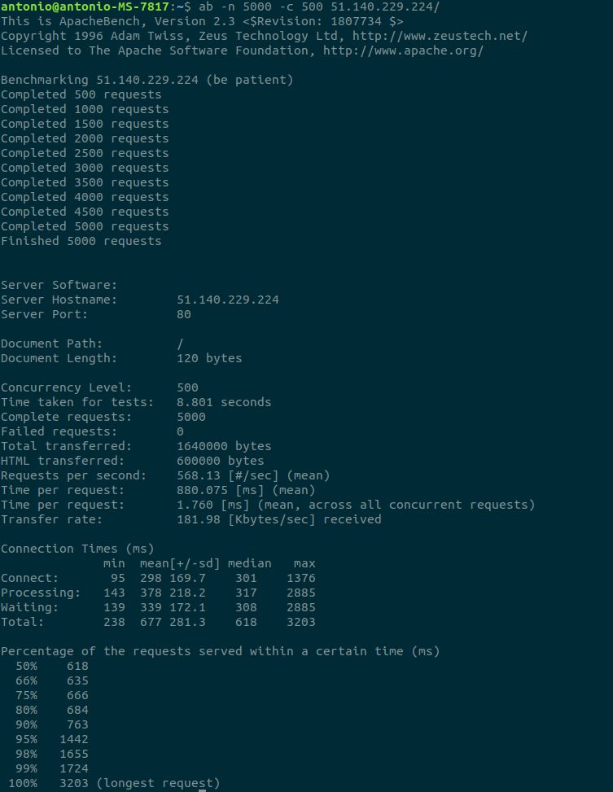
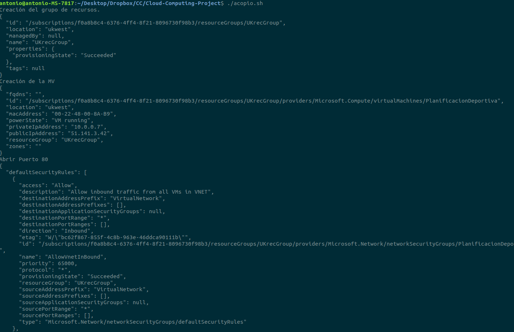
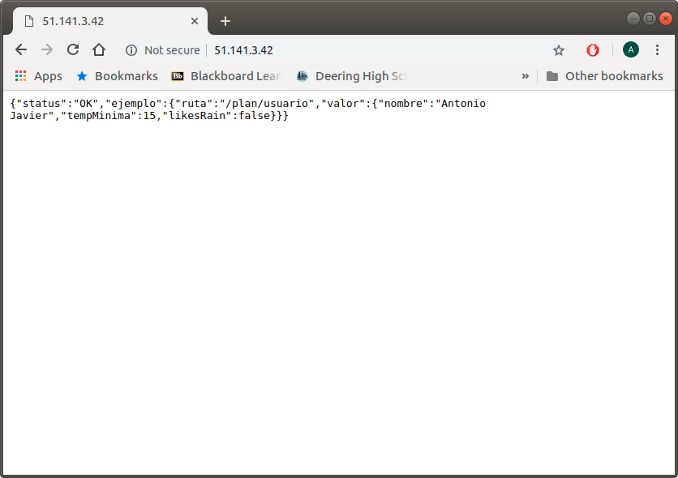

# Hito 4. Automatización de la creación de Máquinas Virtuales desde línea de órdenes.

MV2: 51.141.3.42

## 1. Introducción.

En este hito nos hemos centrado en aprender a crear máquinas virtuales en la nube desde la línea de órdenes para poder realizar su provisionamiento de forma más rápida y masiva. Además de esto, he realizado diversas pruebas y benchmarks para elegir la imagen, la región y el tamaño óptimos de la máquina virtual que tenemos que crear. Por último, también se ha añadido una funcionalidad más a la aplicación, que detallo en mayor profundidad en el [último apartado](https://github.com/AntonioJavierRP/Cloud-Computing-Project/blob/master/docs/hito4-automatizacion.md#funcionalidad-a%C3%B1adida) de este archivo.

## 2. Cliente Elegido

He elegido Azure Cli 2.0 porque ya hemos estado trabajando con Azure en hitos anteriores y contamos con créditos en esta plataforma. Además de que es una de las más utilizadas y cuenta con un amplio abanico de opciones de región, imágenes preparadas y planes de tamaño de máquina.

Para crear una máquina virtual con la linea de ordenes usando Azure Cli 2.0 en primer lugar lo instalamos con apt con: 

~~~~
$ sudo apt-get install azure-cli
~~~~

Una vez instalado iniciamos sesión con azure login y estaremos listos para usar Azure Cli.

Para crear una máquina virtual debemos de elegir la región en la que se alojará, la imagen del SO que usará y un tamaño de máquina (memoria, cores y almacenamiento).

En primer lugar vamos a decidirnos por una región.

## 3. Región

Tal y como explican en su [página oficial](https://azure.microsoft.com/en-us/global-infrastructure/regions/), Azure es el proveedor de servicios en la Nube que cuenta con más regiones globales, por lo que tenemos una gran cantidad de opciones de las que elegir.

Lo primero que se tendría que considerar a la hora de elegir una región en la que se desplegará la MV es de dónde son la mayoría de los usuarios de nuestra aplicación, ya que de nada sirve que nosotros tengamos un acceso rápido al sistema si nuestros usuarios principales tienen una latencia que hace imposible que usen el sistema de forma eficaz. 
De todas formas para nuestro caso consideramos que la mayoría de los usuarios de la aplicación estarán en España, y consideraré que mi latencia será similar a la de éstos usuarios.

Para determinar mi latencia en cada una de las regiones ofrecidas usaré la página de [Azure Speed Test 2.0](http://azurespeedtest.azurewebsites.net/) recomendada en la guía:
https://www.appliedi.net/blog/which-azure-region-is-the-best/

La página de Azure Speed Test nos devuelve los siguientes resultados:

Como se puede observar "France Central" es la que nos ofrece la mejor latencia. Aún así, nos quedaremos también con "West UK" para las comprobaciones posteriores, ya que diferentes regiones ofrecen diferentes imágenes de Sistemas Operativos y diferentes costes, por lo que no podemos dejar que la latencia sea el único factor decisivo.

## 4. Sistema Operativo.

Para visualizar la imágenes que tenemos disponibles en Azure podemos usar la siguiente orden:

~~~~
$az vm image list
~~~~

Esto nos devuelve la información relativa a las imágenes disponibles en formato JSON:

~~~~json
[
  {
    "offer": "CentOS",
    "publisher": "OpenLogic",
    "sku": "7.5",
    "urn": "OpenLogic:CentOS:7.5:latest",
    "urnAlias": "CentOS",
    "version": "latest"
  },
  {
    "offer": "CoreOS",
    "publisher": "CoreOS",
    "sku": "Stable",
    "urn": "CoreOS:CoreOS:Stable:latest",
    "urnAlias": "CoreOS",
    "version": "latest"
  },
  {
    "offer": "Debian",
    "publisher": "credativ",
    "sku": "8",
    "urn": "credativ:Debian:8:latest",
    "urnAlias": "Debian",
    "version": "latest"
  },
  {
    "offer": "openSUSE-Leap",
    "publisher": "SUSE",
    "sku": "42.3",
    "urn": "SUSE:openSUSE-Leap:42.3:latest",
    "urnAlias": "openSUSE-Leap",
    "version": "latest"
  },
  {
    "offer": "RHEL",
    "publisher": "RedHat",
    "sku": "7-RAW",
    "urn": "RedHat:RHEL:7-RAW:latest",
    "urnAlias": "RHEL",
    "version": "latest"
  },
  {
    "offer": "SLES",
    "publisher": "SUSE",
    "sku": "12-SP2",
    "urn": "SUSE:SLES:12-SP2:latest",
    "urnAlias": "SLES",
    "version": "latest"
  },
  {
    "offer": "UbuntuServer",
    "publisher": "Canonical",
    "sku": "16.04-LTS",
    "urn": "Canonical:UbuntuServer:16.04-LTS:latest",
    "urnAlias": "UbuntuLTS",
    "version": "latest"
  },
  {
    "offer": "WindowsServer",
    "publisher": "MicrosoftWindowsServer",
    "sku": "2019-Datacenter",
    "urn": "MicrosoftWindowsServer:WindowsServer:2019-Datacenter:latest",
    "urnAlias": "Win2019Datacenter",
    "version": "latest"
  },
  {
    "offer": "WindowsServer",
    "publisher": "MicrosoftWindowsServer",
    "sku": "2016-Datacenter",
    "urn": "MicrosoftWindowsServer:WindowsServer:2016-Datacenter:latest",
    "urnAlias": "Win2016Datacenter",
    "version": "latest"
  },
  {
    "offer": "WindowsServer",
    "publisher": "MicrosoftWindowsServer",
    "sku": "2012-R2-Datacenter",
    "urn": "MicrosoftWindowsServer:WindowsServer:2012-R2-Datacenter:latest",
    "urnAlias": "Win2012R2Datacenter",
    "version": "latest"
  },
  {
    "offer": "WindowsServer",
    "publisher": "MicrosoftWindowsServer",
    "sku": "2012-Datacenter",
    "urn": "MicrosoftWindowsServer:WindowsServer:2012-Datacenter:latest",
    "urnAlias": "Win2012Datacenter",
    "version": "latest"
  },
  {
    "offer": "WindowsServer",
    "publisher": "MicrosoftWindowsServer",
    "sku": "2008-R2-SP1",
    "urn": "MicrosoftWindowsServer:WindowsServer:2008-R2-SP1:latest",
    "urnAlias": "Win2008R2SP1",
    "version": "latest"
  }
]

~~~~

No sólo disponemos de estas imágenes, esto sólo es una lista disponible offline, podemos acceder a la lista completa con la opción "--all", aunque esto ofrece una lista tan grande que nos conviene filtrarla un poco antes de realizar la búsqueda, por ejemplo, en caso de querer visualizar todas las imágenes que hay disponibles para la región de Francia Central y que contengan el nombre "Ubuntu" podemos usar la siguiente orden:

~~~~
$ az vm image list --all --location francecentral --output table --offer Ubuntu
~~~~

--output table lo devuelve en una formato más legible en lugar de en JSON.

Ésto nos devuelve las siguientes imágenes:

Ésta captura tan sólo contiene una pequeña parte del total que se nos devuelve(en el caso de la región del Oeste de Reino Unido también obtenemos una lista igual de larga ), por lo que deberíamos de haber filtrado aún más la búsqueda. De todas formas, con esto podemos ver que contamos con un amplio abanico de imágenes posibles en ambas regiones.

Basándonos en [éste artículo](https://www.techradar.com/news/best-linux-server-distro) vamos a comparar las siguientes imágenes:

* Ubuntu Server 18.04, con la siguiente URN: Canonical:UbuntuServer:18.04-LTS:18.04.201812060

* Ubuntu Server 16.04, con la siguiente URN: Canonical:UbuntuServer:16.04-LTS:latest

* Debian 8, con la siguiente URN: credativ:Debian:8:latest

Para ello primero creamos 2 grupos de recursos, uno para Francia central y otro para el Oeste de Reino Unido:

~~~~
$ az group create -l francecentral -n FRrecGroup

$ az group create -l ukwest -n UKrecGroup
~~~~

A continuación crearemos 6 máquinas virtuales, ya que comprobaremos las tres imágenes en ambas regiones.

Como todavía no hemos decidido cual es tamaño de máquina virtual óptimo para nuestra aplicación (esto lo elegiremos en el siguiente apartado) usaremos para éstas comprobaciones la opción por defecto: Standard_DS1_v2.

La ordenes que usamos para crear las MVs son las siguientes:

~~~~
$ az vm create -g FRrecGroup -n MV-ub18-FR --nsg-rule ssh --image Canonical:UbuntuServer:18.04-LTS:18.04.201812060

$ az vm create -g FRrecGroup -n MV-ub16-FR --nsg-rule ssh --image Canonical:UbuntuServer:16.04-LTS:latest

$ az vm create -g FRrecGroup -n MV-deb8-FR --nsg-rule ssh --image credativ:Debian:8:latest

$ az vm create -g UKrecGroup -n MV-ub18-UK --nsg-rule ssh --image Canonical:UbuntuServer:18.04-LTS:18.04.201812060

$ az vm create -g UKrecGroup -n MV-ub16-UK --nsg-rule ssh --image Canonical:UbuntuServer:16.04-LTS:latest

$ az vm create -g UKrecGroup -n MV-deb8-UK --nsg-rule ssh --image credativ:Debian:8:latest
~~~~

Medimos cuánto tardan en crearse cada una de las máquinas virtuales con la orden time:

* Francia Central:

  - UB18: 2m 7.650 s

  - UB16: 2m 8.572 s

  - Deb8: 2m 8.987 s

* Oeste Reino Unido:

  - UB18: 2m 7.407 s

  - UB16: 1m 37.513 s

  - Deb8: 2m 7.974 s

Ahora abrimos  el puerto 80 de nuestras MVs con:

~~~~
$ az vm open-port --resource-group <nombredelresourceGroup> --name <nombreMV> --port 80
~~~~

Una vez hecho esto, despliego mi aplicación en cada una de las maquinas virtuales creadas, haciendo uso del Playbook de ansible del Hito anterior, modificando los archivos de configuración para que la IP sea la de las MVs y el usuario sea el mismo, para Ubuntu 16 y para Debian se ha tenido que cambiar un poco el Playbook para que se instale la versión de nodejs que necesitamos, ya que no se hace de la misma forma que en Ubuntu 18. El [playbook modificado para Ubuntu 16](https://github.com/AntonioJavierRP/Cloud-Computing-Project/blob/master/provision/playbook-u16.yml) y el [playbook modificado para Debian 8](https://github.com/AntonioJavierRP/Cloud-Computing-Project/blob/master/provision/playbook-deb8.yml) los he añadido a la carpeta provisión del proyecto.

Los tiempos de despliegue(tiempo de ejecución total del Playbook, lo que incluye la instalación de los paquetes necesarios) en cada una de las MVs han sido:

* Francia Central:

  - UB18: 3m 48.958 s

  - UB16: 3m 10.854 s

  - Deb8: 3m 12.736 s

* Oeste Reino Unido:

  - UB18: 3m 11.969 s

  - UB16: 2m 2.137 s

  - Deb8: 2m 53.184 s

Para comparar el rendimiento de las imágenes haremos uso de [Apache Bench](https://httpd.apache.org/docs/2.4/programs/ab.html), para ello tan solo tendremos que instalarlo con:

~~~~
$ sudo apt install apache2-utils
~~~~

Llamaremos a la orden:

~~~~
$ ab -n 5000 -c 500 <ip_publica>/ 
~~~~

Con cada una de las IPs de las máquinas virtuales, esto hará 5000 peticiones a la página principal de nuestra aplicación desplegada en cada MV con un máximo de 500 peticiones realizadas a la vez, tal y como lo hacen en el ejemplo de [ésta página](https://geekflare.com/web-performance-benchmark/). 

Obtenemos los siguientes resultados:

* Francia Central:

  - UB18: 378.91 peticiones por segundo en un tiempo total de 13.196s

    

  - UB16: 541.85 peticiones por segundo en un tiempo total de 9.228s

    

  - Deb8: 505.18 peticiones por segundo en un tiempo total de 9.897s

    

* Oeste Reino Unido:

  - UB18: 420.99 peticiones por segundo en un tiempo total de 11.877s

    

  - UB16: 568.13 peticiones por segundo en un tiempo total de 8.801s

    

  - Deb8: 511.79 peticiones por segundo en un tiempo total de 9.770s

    

### 4.1 Conclusión.

En base a los resultados que hemos obtenido, vamos a decantarnos por usar la imagen de Ubuntu 16.04 LTS, ya que es la que ha dado los mejores tiempos en todas las pruebas realizadas.
Es la imagen que más rápido se ha creado, en caso de la región del Oeste de Reino Unido. Además, es la que ha conseguido un menor tiempo de despliegue de nuestra aplicación en ambas de las regiones evaluadas. 
Por último, en el caso de los resultados obtenidos mediante Apache Bench también ha sido la mejor en ambas regiones, aunque con resultados muy cercanos a los obtenidos con la imagen de Debian 8.

Dado que los mejores resultados para la imagen elegida se han obtenido en la región del Oeste de Reino Unido, elegiremos ésta región.

## 5. Tamaño

Ya que nuestra aplicación no tiene muchos requerimientos de memoria podemos usar un plan de memoria básico de los que ofrece Azure.

Para visualizar los tamaños disponibles en la región elegida usaremos:

~~~~
$ az vm list-sizes -l ukwest
~~~~

Entre los planes más económicos y básicos tenemos:
* A0 estándar, con 1 núcleo, 0.75 GB de RAM y un precio de 13.80$/mes.

* B1s estándar, con 1 núcleo, 1 GB de RAM y un precio de 8.16$/mes.

* B1ms estándar, con 1 núcleo, 2 GB de RAM y un precio de 14.74$/mes.

El precio del B1s es el menor y ofrece mejores prestaciones que el A0 estándar, pero puede que esto sólo se trate de una oferta temporal, por lo que vamos a comprobar el rendimiento de estos planes de memoria con nuestra aplicación.

Para ello, he creado 3 máquinas virtuales con una imagen de Ubuntu 16-04 LTS en la región elegida, cada una con un plan diferente y he medido el tiempo que tardan en realizar los test de la aplicación(es decir, el tiempo en que tarda en ejecutarse npm test). Estos han sido los resultados obtenidos:

* A0 estándar: 2.458s 
* B1s estándar: 1.363s
* B1ms estándar: 1.312s

La diferencia entre A0 estándar y B1s estándar es notable, mientras que entre el B1s y B1ms es mínima, por lo que optaremos por quedarnos con el plan B1s estándar, que además por ahora tiene el mejor precio.

## Script.

Ya que hemos decidido cuales van a ser cada una de las partes a elegir a la hora de crear una Máquina Virtual en la Nube, hemos creado un Script que automatice la creación de la máquina virtual que queremos a través de órdenes de Azure Cli.

Este script se llama [acopio.sh](https://github.com/AntonioJavierRP/Cloud-Computing-Project/blob/master/acopio.sh) y contiene las siguientes órdenes:

* 1. Creación del grupo de recursos.

~~~~
$ az group create -l ukwest -n UKrecGroup
~~~~
Tal y como lo hicimos y explicamos en nuestras comprobaciones.

* 2. Creación de la Máquina virtual.
~~~~
$ az vm create -g UKrecGroup -n PlanificacionDeportiva --nsg-rule ssh --image Canonical:UbuntuServer:16.04-LTS:latest --size Standard_B1s --public-ip-address-allocation static --admin-username usuario-azure
~~~~
Con esta orden creamos una MV llamada PlanificaciónDeportiva con la imagen que elegimos, el tamaño que elegimos, especificando el usuario para que concuerde con el que tenemos especificado en la carpeta de provisionamiento de ansible y con la IP estática para que cuando se reinicie la máquina no tenga una IP diferente.

* 3. Abrir Puerto 80

~~~~
az vm open-port --resource-group UKrecGroup --name PlanificacionDeportiva --port 80
~~~~

Ejecutando este script obtenemos la siguiente salida.

Ya que tenemos creada la Máquina Virtual que queremos podemos desplegar en ésta nuestra aplicación con nuestro playbook de Ansible. Probamos la IP en el navegador y podemos ver que se ha desplegado correctamente:

## Funcionalidad Añadida.

Para terminar, el avance que se ha hecho con la aplicación durante este hito ha sido la adaptación de las estructuras de clases creadas para que se ajusten en base a los datos climatológicos y para que la API REST devuelva error en caso de que no se cumplan los requisitos de temperatura y clima a la hora de declarar una nueva actividad o modificar una existente.

Para ello he creado una nueva clase TiempoAtm (en el fichero TiempoAtm.js) que contiene los datos climatológicos de un día concreto y consta de los siguientes atributos:

* temperaturaDia: temperatura media (en grados Celsius) que hace durante el día del día en concreto (de 6 a.m. a 7 p.m.).

* temperaturaNoche: temperatura media (en grados Celsius) que hace durante la noche del día en concreto (de 8 p.m. a 5 a.m.).

* tiempo: clima del día en concreto, puede ser: soleado, nublado, lluvia, granizo y nieve.

Para la versión actual del proyecto, al no estar todavía comunicados con el microservicio que nos aporta los datos meteorológicos reales, se han tenido que especificar unos datos predeterminados para comprobar que ésta nueva funcionalidad funciona correctamente.
Estos datos los he creado en index.js, y se corresponden a los 7 primeros días del planning, por eso los he llamado tatm1,tatm2,tatm3,tatm4,tatm5,tatm6 y tatm7.

Por último, he modificado los PUT y POST de actividades nuevas, para que tengan en cuenta el tiempo atmosférico especificado, llamando a la función "validateActivityWithData" cada vez que se intente crear o modificar una actividad referente a un día del que se tengan datos meteorológicos.

